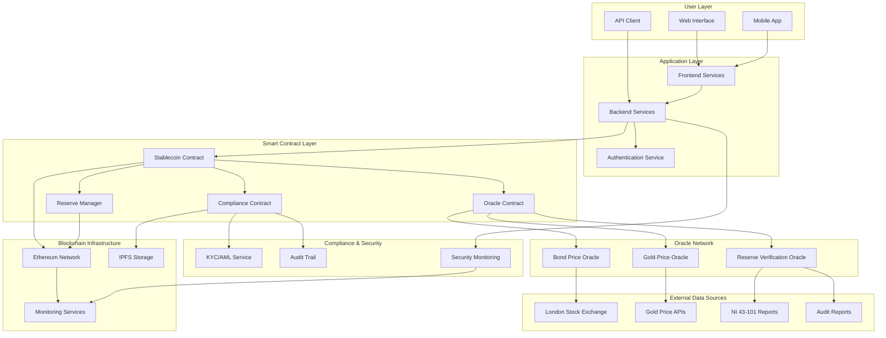

# System Architecture

## Overview

The gold-backed stablecoin system is designed as a decentralized, transparent, and regulatory-compliant platform that bridges traditional gold-backed financial instruments with blockchain technology.

## Architecture Diagram

## Component Descriptions

### User Layer
- **Web Interface**: Browser-based application for token operations
- **Mobile App**: Native mobile application for on-the-go access
- **API Client**: Programmatic access for institutional users

### Application Layer
- **Frontend Services**: User interface logic and presentation
- **Backend Services**: Business logic and data processing
- **Authentication Service**: User authentication and authorization

### Smart Contract Layer
- **Stablecoin Contract**: Core ERC-20 token implementation
- **Reserve Manager**: Collateral management and reserve tracking
- **Oracle Contract**: Price feed aggregation and validation
- **Compliance Contract**: Regulatory compliance and reporting

### Oracle Network
- **Gold Price Oracle**: Real-time gold price feeds
- **Bond Price Oracle**: LSE bond pricing data
- **Reserve Verification Oracle**: Gold reserve validation

### External Data Sources
- **London Stock Exchange**: Bond pricing and trading data
- **Gold Price APIs**: Real-time gold market data
- **NI 43-101 Reports**: Gold resource and reserve reports
- **Audit Reports**: Independent audit and verification data

### Blockchain Infrastructure
- **Ethereum Network**: Primary blockchain for smart contracts
- **IPFS Storage**: Decentralized storage for documents and reports
- **Monitoring Services**: System health and performance monitoring

### Compliance & Security
- **KYC/AML Service**: Customer verification and compliance
- **Audit Trail**: Immutable transaction and compliance records
- **Security Monitoring**: Threat detection and response

## Data Flow

### Token Minting Process
1. User initiates minting request through web interface
2. System verifies KYC/AML compliance
3. User deposits gold-backed bonds
4. Reserve Manager validates bond authenticity
5. Oracle verifies current bond and gold values
6. Stablecoin contract mints tokens 1:1 with bond value
7. Transaction recorded on blockchain and audit trail

### Token Burning Process
1. User initiates burning request
2. System verifies token ownership
3. Stablecoin contract burns tokens
4. Reserve Manager releases equivalent bonds
5. User receives bonds or equivalent gold value
6. Transaction recorded and compliance reported

### Reserve Verification Process
1. Oracle network continuously monitors gold prices
2. Bond prices updated from LSE feeds
3. Reserve Manager calculates total collateral value
4. Compliance contract generates proof-of-reserves
5. Public reporting of reserve status
6. Alerts triggered if reserve ratio falls below threshold

## Security Considerations

### Smart Contract Security
- **Multi-signature Wallets**: Critical operations require multiple signatures
- **Time Locks**: Important changes have mandatory waiting periods
- **Upgrade Mechanisms**: Controlled upgrade paths for contract improvements
- **Emergency Procedures**: Circuit breakers and emergency redemption

### Data Security
- **Encryption**: All sensitive data encrypted at rest and in transit
- **Access Controls**: Role-based access control for all systems
- **Audit Logging**: Comprehensive logging of all system activities
- **Backup Procedures**: Regular backups and disaster recovery plans

### Compliance Security
- **Data Privacy**: GDPR and other privacy regulation compliance
- **Regulatory Reporting**: Automated compliance reporting
- **Sanctions Screening**: Regular screening against sanctions lists
- **Transaction Monitoring**: Real-time monitoring for suspicious activity

## Scalability Considerations

### Performance Optimization
- **Layer 2 Solutions**: Integration with Ethereum Layer 2 networks
- **Oracle Optimization**: Efficient oracle data aggregation
- **Caching Strategies**: Intelligent caching of frequently accessed data
- **Load Balancing**: Distributed processing for high-volume operations

### Future Enhancements
- **Cross-Chain Integration**: Support for multiple blockchain networks
- **Advanced Oracles**: Machine learning-enhanced price prediction
- **Automated Market Making**: Liquidity provision mechanisms
- **Institutional Features**: Advanced features for institutional users

## Monitoring and Maintenance

### System Monitoring
- **Health Checks**: Continuous monitoring of all system components
- **Performance Metrics**: Real-time performance and capacity monitoring
- **Error Tracking**: Comprehensive error logging and alerting
- **Security Monitoring**: Threat detection and incident response

### Maintenance Procedures
- **Regular Updates**: Scheduled updates for all system components
- **Security Patches**: Immediate application of security updates
- **Performance Tuning**: Continuous optimization of system performance
- **Disaster Recovery**: Regular testing of backup and recovery procedures
